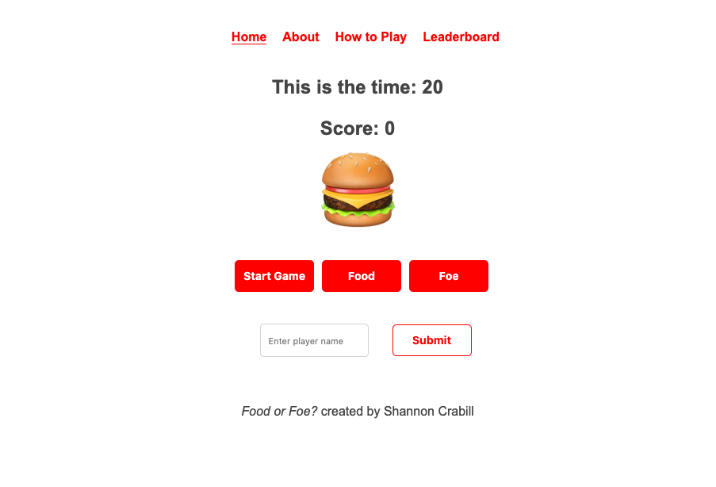

# Food or Foe?



How many food emoji can you correctly identify in 30 seconds?

Each correct answer is worth 1 point. A wrong answer decreases your score by 1 point.

At the end of a round, add your name and score to the leaderboard!

Happy guessing!

## Installation

```
git clone https://github.com/scrabill/food-or-foe-react.git
```

To get the API up and running:

```
cd food-or-foe-react/backend
rails db:migrate
rails db:seed
rails s
```

And the frontend:

```
cd food-or-foe-react/frontend
npm install
npm start
```

To play, open `http://localhost:3006` in a browser.

## API Endpoints

_Food or Foe?_ has three models, each of which can be accessed at the following endpoints.

- http://localhost:3000/api/v1/users
- http://localhost:3000/api/v1/games
- http://localhost:3000/api/v1/emojis
- http://localhost:3000/api/v1/emojis/food

## Contributing

Is this game missing your favorite emoji?

To contribute, please [make a pull request](https://github.com/scrabill/food-or-foe-react/pull/new/master) with the name of the emoji, it's character and if it is a food or not to the [backend/db/seeds.rb](https://github.com/scrabill/food-or-foe-react/blob/master/backend/db/seeds.rb) file.

Here's how I would add 🍔 (hamburger)

```ruby
Emoji.create(slug: "hamburger", character: "🍔", is_food?: true)
```

The [Unicode emoji list](https://unicode.org/emoji/charts/emoji-list.html) is a great resource for finding interesting emojis to contribute.

## Future Enhancements

- Host on Heroku
- Limit leaderboard to top 10–20 scores
- HARD MODE - One wrong guess and the game is over
- Player feedback - Good job! Missing one!
- Multiplier for multiple correct guesses in a row
- Testing mode - 3 second timer instead of 30 seconds
- Accept keyboard inputs for Food or Foe buttons
- Error messaging
- Continuous deployment
- Is this game accessible?
- Improve mobile rendering (portrait or landspace?)
- Late night craving mode (dark mode)

## Bugs

If you encounter any bugs or glitches while playing, please [open an issue](https://github.com/scrabill/food-or-foe-react/issues/new/choose) so that I can look into finding a fix.

## Misc

This is the React & Redux version of the Food or Foe? game [the Javascript version can be found here](https://github.com/scrabill/food-or-foe).
